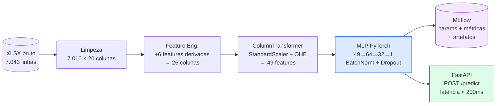

# Telco Customer Churn — Previsão de Cancelamento com MLP


Sistema **end-to-end de Machine Learning** que prevê quais clientes de uma operadora de
telecom têm maior risco de cancelamento (churn), permitindo ações proativas de retenção.
O modelo central é uma **rede neural MLP** construída com PyTorch, servida via API FastAPI
e rastreada com MLflow. ROC-AUC de **0,8611** no test set, superando o baseline (Regressão
Logística, AUC 0,8425).

---

## Resultados

| Modelo | ROC-AUC | F1 | Recall | Threshold |
|---|---|---|---|---|
| DummyClassifier | 0,500 | — | 0,000 | — |
| Logistic Regression (baseline) | 0,8425 | — | 0,710 | 0,5 |
| **MLP PyTorch (final)** | **0,8611** | **0,6537** | **0,7204** | **0,5996** |

Threshold custo-ótimo (minimiza perda de LTV): 0,10 → Recall de 94,6%.
Detalhes em [docs/results.md](docs/results.md) e [docs/decisions/002-threshold-cost-sensitive.md](docs/decisions/002-threshold-cost-sensitive.md).

---

## Arquitetura do Pipeline



Pipeline completo com diagramas detalhados: [docs/architecture_diagrams.md](docs/architecture_diagrams.md).

---

## Dataset

O arquivo bruto **não está versionado** no repositório. Faça o download manualmente antes de rodar o pipeline:

1. Acesse: [Telco Customer Churn — IBM Dataset (Kaggle)](https://www.kaggle.com/datasets/yeanzc/telco-customer-churn-ibm-dataset)
2. Baixe o arquivo `Telco_customer_churn.xlsx`
3. Coloque-o em `data/raw/Telco_customer_churn.xlsx`

Depois execute:

```bash
make data-clean  # XLSX → data/processed/telco_churn_cleaned.csv
make train       # treina o modelo com os dados processados
```

---

## Quickstart

```bash
# 1. Clonar, instalar dependências e configurar .env
git clone <repo-url>
cd telco-churn-mlp
make setup
# Edite o JWT_SECRET em .env antes de continuar

# 2. Limpar dados e treinar
make data-clean
make train

# 3. Subir a API e o frontend
make run-api        # Terminal 1 → http://localhost:8000/docs
make run-streamlit  # Terminal 2 → http://localhost:8501

# 4. Rodar testes e lint
make test
make lint
```

**Credenciais padrão (desenvolvimento):**

| Usuário | Senha |
|---|---|
| `admin` | `admin123` |
| `user` | `user123` |

**Exemplo de requisição à API (com autenticação):**

```bash
# 1. Obter token
TOKEN=$(curl -s -X POST http://localhost:8000/login \
  -H "Content-Type: application/json" \
  -d '{"username": "admin", "password": "admin123"}' | python -c "import sys,json; print(json.load(sys.stdin)['access_token'])")

# 2. Fazer predição
curl -X POST http://localhost:8000/predict \
  -H "Content-Type: application/json" \
  -H "Authorization: Bearer $TOKEN" \
  -d '{
    "tenure_months": 2,
    "monthly_charges": 70.0,
    "total_charges": 140.0,
    "contract": "Month-to-month",
    "internet_service_type": "Fiber optic",
    "senior_citizen": "No",
    "partner": "No",
    "dependents": "No",
    "phone_service": "Yes",
    "multiple_lines": "No",
    "online_security": "No",
    "online_backup": "No",
    "device_protection": "No",
    "tech_support": "No",
    "streaming_tv": "No",
    "streaming_movies": "No",
    "paperless_billing": "Yes",
    "payment_method": "Electronic check",
    "gender": "Male"
  }'
```

---

## Estrutura do Projeto

```
telco-churn-mlp/
├── src/
│   ├── data/            # Carregamento e limpeza (cleaner.py)
│   ├── features/        # Feature engineering (engineer.py)
│   ├── models/          # Definição do MLP (mlp.py)
│   ├── training/        # Loop de treino com MLflow (train.py)
│   ├── inference/       # Pipeline de inferência (predictor.py)
│   ├── schemas/         # Validação Pydantic + Pandera
│   ├── api/             # Serviço FastAPI (main.py)
│   ├── app/             # Frontend Streamlit (app.py)
│   ├── config.py        # Seeds e paths centralizados
│   └── logger.py        # Logging estruturado (structlog)
├── data/
│   ├── raw/             # Telco_customer_churn.xlsx (imutável)
│   └── processed/       # telco_churn_cleaned.csv
├── models/              # preprocessor_mlp.pkl · mlp_weights.pt · mlp_config.json
├── notebooks/           # 01_eda · 02_baseline · 03_model_engineering · 04_mlp_pytorch
├── tests/               # pytest: unitários, schema Pandera, smoke
├── docs/
│   ├── model-card.md            # Model Card completo (9 seções)
│   ├── monitoring-plan.md       # Plano de monitoramento com playbook
│   ├── architecture_diagrams.md # Diagramas Mermaid detalhados
│   ├── results.md               # Tabela comparativa de experimentos
│   ├── decisions/               # ADRs de decisões arquiteturais
│   └── mlflow_artifacts/        # Screenshots de experimentos
├── pyproject.toml       # Dependências e configuração (single source of truth)
├── .env.example         # Template de variáveis de ambiente
└── Makefile             # setup · data-clean · train · run-api · run-streamlit · test · lint
```

---

## Documentação

| Documento | Descrição |
|---|---|
| [Model Card](docs/model-card.md) | Arquitetura, métricas com IC 95%, fairness, LGPD, limitações |
| [Plano de Monitoramento](docs/monitoring-plan.md) | PSI, thresholds de alerta, frequência, playbook de resposta |
| [Diagramas de Arquitetura](docs/architecture_diagrams.md) | 5 diagramas Mermaid: treino, inferência, arquitetura completa, sequência da API e mapa de coerência |
| [Resultados MLflow](docs/results.md) | Tabela comparativa de experimentos e parâmetros finais |
| [ADR 001 — PyTorch](docs/decisions/001-uso-de-pytorch.md) | Por que PyTorch e não sklearn/XGBoost |
| [ADR 002 — Threshold](docs/decisions/002-threshold-cost-sensitive.md) | Threshold custo-sensitivo: F1-ótimo vs custo-ótimo |
| [ADR 003 — pos_weight](docs/decisions/003-pos-weight-balancing.md) | Por que pos_weight e não SMOTE/oversampling |

---

## Tecnologias

| Categoria | Stack |
|---|---|
| Modelo | PyTorch 2.x (MLP), Scikit-Learn (pipeline, baselines) |
| API | FastAPI + Pydantic v2 + Uvicorn |
| Validação de dados | Pandera (schema + ranges) |
| Rastreamento | MLflow (params, métricas, artefatos, model registry) |
| Testes | pytest (unitários, schema, smoke) |
| Qualidade de código | ruff (lint + format) |
| Logging | structlog (logging estruturado, sem `print()`) |

---

## Roadmap

**Estágio 1 — Entendimento e Preparação**
- [x] EDA completa — distribuições, missing, correlações, análise de churn por segmento
- [x] Baselines: DummyClassifier + Logistic Regression com MLflow

**Estágio 2 — Modelagem**
- [x] Feature Engineering — 6 novas features (top preditoras em importância Gini e permutação)
- [x] Model Engineering — Decision Tree, Random Forest, SVM, Gradient Boosting + tuning
- [x] MLP PyTorch — [64, 32], BatchNorm, Dropout, early stopping (época 43)
- [x] Análise de custo FP vs FN — threshold custo-ótimo 0,10 (Recall 94,6%)
- [x] Comparação final: 5 modelos, 5 métricas — MLP com maior ROC-AUC e F1

**Estágio 3 — Engenharia e API**
- [x] Código modular em `src/` com princípios SOLID
- [x] Pipeline reprodutível (ColumnTransformer + FeatureEngineer customizado)
- [x] API FastAPI com validação Pydantic + Pandera + middleware de latência
- [x] Testes automatizados (smoke, schema, unitários)

**Estágio 4 — Documentação**
- [x] Model Card (`docs/model-card.md`)
- [x] Plano de monitoramento (`docs/monitoring-plan.md`)
- [x] ADRs de decisões arquiteturais (`docs/decisions/`)
- [ ] Vídeo de apresentação STAR (5 min)
