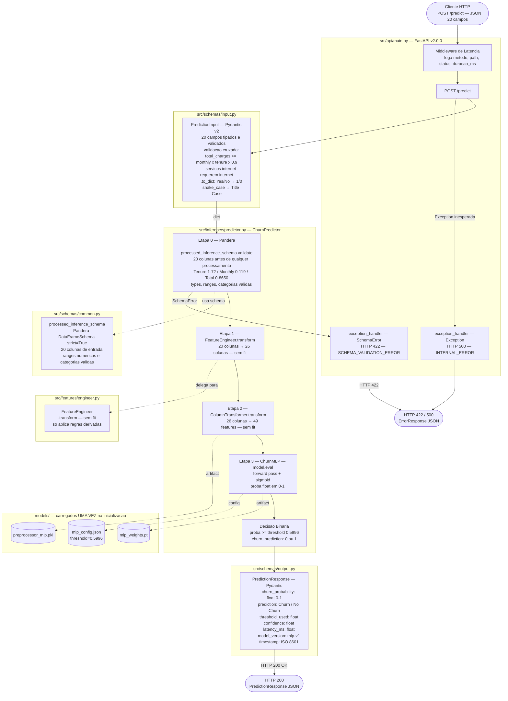
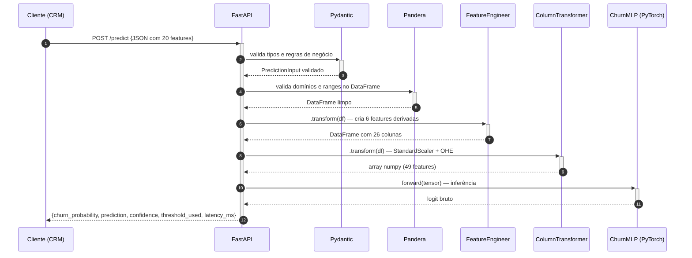
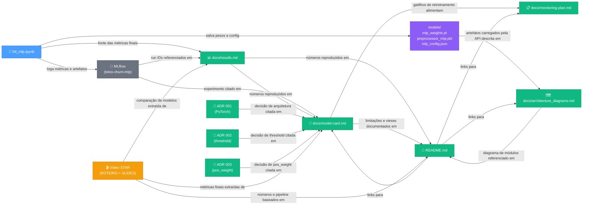

# Diagramas de Arquitetura — Telco Churn MLP

Visão visual dos fluxos de dados, módulos e artefatos do projeto. Cinco diagramas, cada um respondendo uma pergunta diferente:

1. [Pipeline de Treino](#1-pipeline-de-treino) — *Como os dados brutos viram artefatos treinados?*
2. [Pipeline de Inferência e API](#2-pipeline-de-inferência-e-api) — *Como um JSON de entrada vira uma predição?*
3. [Arquitetura Completa](#3-arquitetura-completa) — *Quais módulos são compartilhados entre treino e inferência?*
4. [Sequência de Requisição à API](#4-sequência-de-requisição-à-api) — *Em que ordem os componentes são acionados a cada chamada?*
5. [Mapa de Coerência entre Artefatos](#5-mapa-de-coerência-entre-artefatos) — *O que garante que README, Model Card e vídeo dizem a mesma coisa?*

---

## 1. Pipeline de Treino

> **Pergunta respondida:** como os dados brutos (`Telco_customer_churn.xlsx`) viram os três artefatos em `models/` que a API usa em produção?

Executado em dois passos: `make clean-data` e depois `make train`.

```mermaid
flowchart TD
    START_RAW(["make clean-data
    python -m src.data.cleaner"])

    START_TRAIN(["make train
    python -m src.training.train"])

    subgraph CFG["src/config.py"]
        CONFIG["RANDOM_SEED=42
        DATA_RAW_DIR
        DATA_PROCESSED_DIR
        MODELS_DIR
        RAW_DATA_FILE"]
    end

    subgraph CLEANER["src/data/cleaner.py"]
        C1["1. Carrega XLSX
        Telco_customer_churn.xlsx
        7043 x 33 colunas"]
        C2["2. Converte Total Charges para float
        strings vazias geram NaN"]
        C3["3. Remove 11 linhas Tenure == 0
        clientes sem historico de cobranca"]
        C4["4. Remove 22 duplicatas
        mesmo perfil de features
        CustomerID distintos"]
        C5["5. Remove 13 colunas
        sem variancia, identificadores
        data leakage: Churn Score, CLTV
        Churn Reason, Churn Label"]
        C6["6. Converte binarias Yes/No para 0/1
        Senior Citizen, Partner, Dependents
        Phone Service, Paperless Billing"]
        C7["7. Salva CSV
        telco_churn_cleaned.csv
        7010 x 20 colunas"]
        C1-->C2-->C3-->C4-->C5-->C6-->C7
    end

    subgraph FE_MOD["src/features/engineer.py"]
        FE["FeatureEngineer — TransformerMixin
        + services_count 0-6
        + tenure_group new/growing/loyal
        + monthly_per_tenure
        + has_protection 0/1
        + is_senior_alone 0/1
        + contract_risk_score 0/1/3"]
    end

    subgraph MLP_MOD["src/models/mlp.py"]
        MLP["ChurnMLP — nn.Module
        Linear → BatchNorm1d → ReLU → Dropout
        por camada oculta — configuravel via JSON"]
    end

    subgraph TRAINING["src/training/train.py"]
        T1["1. Reprodutibilidade
        np.random.seed + torch.manual_seed
        cudnn.deterministic=True / seed=42"]
        T2["2. Carrega CSV limpo
        telco_churn_cleaned.csv
        7010 x 20 colunas"]
        T3["3. FeatureEngineer.fit_transform
        20 colunas → 26 colunas"]
        T4["4. Split Estratificado
        70% treino / 15% val / 15% teste
        stratify=Churn Value, seed=42"]
        T5["5. ColumnTransformer — fit APENAS em X_train
        StandardScaler — 13 numericas
        OneHotEncoder — 13 categoricas
        26 colunas → 49 features"]
        T6["6. TensorDataset + DataLoader
        batch_size=64, shuffle=True"]
        T7["7. ChurnMLP
        input_dim=49, hidden=[64,32], dropout=0.3"]
        T8["8. Loop de Treino
        BCEWithLogitsLoss + pos_weight
        Adam lr=1e-3, weight_decay=1e-4
        ReduceLROnPlateau patience=8
        Early Stopping patience=15, max=150 epocas"]
        T9["9. Avaliacao no Test Set
        ROC-AUC: 0.8611 / PR-AUC: 0.6748
        F1: 0.6537 / Recall: 0.7204"]
        T10["10. Threshold F1-otimo
        curva Precision-Recall → 0.5996"]
        T11["11. MLflow — telco-churn-mlp
        log_params + log_metrics
        curvas de loss por epoca + log_model pytorch"]
        T12["12. Salva Artefatos em models/
        preprocessor_mlp.pkl
        mlp_weights.pt
        mlp_config.json"]
    end

    subgraph DISK["models/"]
        PKL[("preprocessor_mlp.pkl
        ColumnTransformer treinado")]
        WPT[("mlp_weights.pt
        state_dict PyTorch")]
        CFJ[("mlp_config.json
        input_dim, hidden_dims
        dropout_rate, threshold")]
    end

    subgraph MLFLOW["MLflow — telco-churn-mlp"]
        MFR["params + metrics
        curvas de loss por epoca
        model snapshot PyTorch"]
    end

    START_RAW --> C1
    C1 -.->|le paths de| CONFIG
    START_TRAIN --> T1
    T1 -.->|le RANDOM_SEED de| CONFIG
    C7 -->|CSV gerado| T2
    T1 --> T2 --> T3 --> T4 --> T5 --> T6 --> T7 --> T8 --> T9 --> T10 --> T11 --> T12
    T3 -.->|delega para| FE
    T7 -.->|instancia| MLP
    T11 --> MFR
    T12 --> PKL
    T12 --> WPT
    T12 --> CFJ
```



### Etapas criticas do cleaner

| Etapa | Por que e importante |
|---|---|
| **2. Total Charges para float** | O Excel armazena valores em branco como string vazia. `pd.to_numeric(..., errors="coerce")` converte e revela os 11 NaN. |
| **3. Remove Tenure == 0** | Todos os 11 NaN coincidem com clientes de zero meses — sem historico de cobranca, sem sinal preditivo. |
| **4. Remove duplicatas** | 22 registros com `CustomerID` distintos mas perfil identico distorceriam o treino ao repetir os mesmos exemplos. |
| **5. Remove leakage** | `Churn Score`, `CLTV` e `Churn Reason` sao derivados do churn ja ocorrido — incluí-los seria treinar com a resposta. |
| **6. Binarias → 0/1** | `Senior Citizen`, `Partner`, `Dependents`, `Phone Service`, `Paperless Billing` sao tratadas como numericas no `ColumnTransformer`. |

### Etapas criticas do treino

| Etapa | Por que e importante |
|---|---|
| **1. Fix Seeds** | Garante que duas execucoes de `make train` produzam os mesmos pesos. `cudnn.deterministic=True` necessario para GPUs. |
| **5. CT.fit apenas em X_train** | Evita *data leakage*: o scaler nao pode ver as estatisticas de val/test durante o fit. |
| **8. pos_weight** | O dataset tem 26% de churn. Sem correcao, o modelo aprende a dizer "nao churn" para tudo e ainda acerta 74%. O `pos_weight = negativos/positivos` reequilibra a loss. |
| **8. Early Stopping patience=15** | Interrompe o treino quando a `val_loss` para de melhorar, evitando overfitting sem precisar de um numero fixo de epocas. |
| **10. Threshold F1-otimo** | O `pos_weight` desloca a distribuicao de probabilidades, tornando o threshold padrao 0.5 subotimo. O threshold 0.5996 e calculado na curva Precision-Recall do test set. |
| **12. Salva 3 artefatos** | `preprocessor_mlp.pkl` + `mlp_weights.pt` + `mlp_config.json` sao os tres arquivos que a inferencia precisa. O `config.json` carrega a arquitetura e o threshold automaticamente. |

---

## 2. Pipeline de Inferência e API

> **Pergunta respondida:** quais etapas de validação e transformação um payload percorre entre o `POST /predict` e o `HTTP 200`?

Executado por `make run-api` → `uvicorn src.api.main:app --reload`.



### Etapas criticas da inferencia

| Etapa | Por que e importante |
|---|---|
| **Middleware de Latencia** | Loga `duracao_ms` de toda requisicao em `src/logger.py` (structlog). Permite detectar degradacao de performance sem instrumentacao adicional. |
| **PredictionInput Pydantic** | Primeira linha de defesa: valida tipos, valores e regras de negocio (ex: `total_charges` coerente com `tenure` e `monthly_charges`) antes de qualquer codigo de ML ser executado. |
| **Etapa 0 — Pandera** | Segunda linha de defesa: valida o DataFrame depois da conversao `to_dict`. Detecta colunas ausentes, tipos errados e valores fora dos dominios esperados. Qualquer `SchemaError` retorna HTTP 422 com mensagem descritiva — nao HTTP 500. |
| **FE.transform sem fit** | O `FeatureEngineer` e *stateless*, entao `.transform` e `.fit_transform` sao equivalentes. Mas chamar apenas `.transform` deixa explicito que nao ha estado aprendido a preservar. |
| **CT.transform sem fit** | O `ColumnTransformer` TEM estado (medias e categorias aprendidas no treino). Chamar `.transform` (nao `.fit_transform`) garante que os mesmos parametros do treino sao aplicados nos dados de producao. |
| **model.eval()** | Desativa dropout e usa `running_stats` do BatchNorm (ao inves de estatisticas do batch atual). Sem isso, a predicao seria nao-deterministica e diferente do treino. |
| **Artefatos carregados na inicializacao** | `ChurnPredictor.__init__` carrega `.pkl`, `.pt` e `.json` uma unica vez quando a API sobe. Cada requisicao reutiliza os objetos em memoria — sem I/O por request. |

---

## 3. Arquitetura Completa

> **Pergunta respondida:** quais módulos são exclusivos de cada pipeline e quais são compartilhados — e onde está o risco de inconsistência se algo mudar?

Visão unificada dos dois pipelines, módulos compartilhados e artefatos como ponte entre treino e inferência.

```mermaid
flowchart LR
    classDef cleaning fill:#fef3c7,stroke:#d97706,color:#78350f
    classDef training fill:#dbeafe,stroke:#2563eb,color:#1e3a5f
    classDef inference fill:#dcfce7,stroke:#16a34a,color:#14532d
    classDef shared fill:#fef9c3,stroke:#ca8a04,color:#713f12
    classDef schema fill:#ffe4e6,stroke:#e11d48,color:#881337
    classDef storage fill:#f3e8ff,stroke:#9333ea,color:#4a044e
    classDef io fill:#f8fafc,stroke:#64748b,color:#1e293b

    XLSX[("Telco_customer_churn.xlsx
    7043 x 33 colunas")]:::io
    HTTP_IN(["POST /predict
    JSON"]):::io

    subgraph CLEAN["LIMPEZA — src/data/cleaner.py"]
        direction TB
        CL1["1. Carrega XLSX"]:::cleaning
        CL2["2. Total Charges → float"]:::cleaning
        CL3["3. Remove Tenure == 0
        11 linhas"]:::cleaning
        CL4["4. Remove duplicatas
        22 linhas"]:::cleaning
        CL5["5. Remove 13 colunas
        leakage + identificadores"]:::cleaning
        CL6["6. Binarias Yes/No → 0/1"]:::cleaning
        CL7["7. Salva CSV
        7010 x 20 colunas"]:::cleaning
        CL1-->CL2-->CL3-->CL4-->CL5-->CL6-->CL7
    end

    subgraph TRAIN["TREINO — src/training/train.py"]
        direction TB
        TR1["1. Fix Seeds
        seed=42 np+torch+cudnn"]:::training
        TR2["2. Load CSV limpo"]:::training
        TR3["3. FE.fit_transform
        20 → 26 cols"]:::training
        TR4["4. Split 70/15/15
        estratificado"]:::training
        TR5["5. CT.fit em X_train
        26 → 49 features"]:::training
        TR6["6. DataLoader
        batch=64 shuffle"]:::training
        TR7["7. ChurnMLP
        49→64→32→1"]:::training
        TR8["8. Treino
        BCELoss + pos_weight
        Adam + ReduceLROnPlateau
        EarlyStopping p=15"]:::training
        TR9["9. Avaliacao
        ROC-AUC / PR-AUC / F1"]:::training
        TR10["10. Threshold
        F1-otimo = 0.5996"]:::training
        TR11["11. MLflow log"]:::training
        TR12["12. Salva artefatos"]:::training
        TR1-->TR2-->TR3-->TR4-->TR5-->TR6-->TR7-->TR8-->TR9-->TR10-->TR11-->TR12
    end

    subgraph SHARED["MODULOS COMPARTILHADOS"]
        direction TB
        FEX["src/features/engineer.py
        FeatureEngineer
        + 6 features derivadas
        fit_transform no treino
        transform na inferencia"]:::shared
        MLPX["src/models/mlp.py
        ChurnMLP nn.Module
        Linear-BN-ReLU-Dropout
        por camada configuravel"]:::shared
        CFGX["src/config.py
        RANDOM_SEED=42
        DATA_RAW_DIR
        DATA_PROCESSED_DIR
        MODELS_DIR"]:::shared
        LOGX["src/logger.py
        structlog
        logging estruturado
        sem print()"]:::shared
    end

    subgraph SCHEMAS["SCHEMAS — src/schemas/"]
        direction TB
        SCI["input.py
        PredictionInput — Pydantic
        API boundary — 20 campos
        validacao cruzada"]:::schema
        SCC["common.py
        4 DataFrameSchemas — Pandera
        processed + engineered
        train + inference
        ranges, tipos, categorias"]:::schema
        SCO["output.py
        PredictionResponse
        HealthResponse
        ErrorResponse — Pydantic"]:::schema
    end

    subgraph STORAGE["ARTEFATOS — models/"]
        direction TB
        PKL[("preprocessor_mlp.pkl
        ColumnTransformer treinado")]:::storage
        WPT[("mlp_weights.pt
        state_dict PyTorch")]:::storage
        CFJ[("mlp_config.json
        input_dim, hidden_dims
        dropout_rate, threshold")]:::storage
        MFA[("MLflow
        telco-churn-mlp
        params+metrics+model")]:::storage
    end

    subgraph INFER["INFERENCIA — src/api + src/inference"]
        direction TB
        I0["FastAPI POST /predict
        Middleware de Latencia"]:::inference
        I1["PredictionInput Pydantic
        20 campos + validacao cruzada
        .to_dict Yes/No→1/0"]:::inference
        I2["Etapa 0 — Pandera
        processed_inference_schema
        validacao ANTES de tudo"]:::inference
        I3["Etapa 1 — FE.transform
        20 → 26 cols — sem fit"]:::inference
        I4["Etapa 2 — CT.transform
        26 → 49 features — sem fit"]:::inference
        I5["Etapa 3 — ChurnMLP
        forward + sigmoid → proba"]:::inference
        I6["Threshold 0.5996
        Churn / No Churn"]:::inference
        I7["PredictionResponse
        prob, pred, latency_ms"]:::inference
        IERR["SchemaError → HTTP 422
        Exception → HTTP 500"]:::inference
        I0-->I1-->I2-->I3-->I4-->I5-->I6-->I7
        I2-->|SchemaError|IERR
    end

    HTTP_OK(["HTTP 200 OK"]):::io
    HTTP_ERR(["HTTP 422 / 500"]):::io

    XLSX --> CL1
    CL1 -.->|paths de| CFGX
    CL7 -->|CSV 7010x20| TR2
    HTTP_IN --> I0

    TR1 -.->|seed| CFGX
    TR3 -.->|fit_transform| FEX
    TR7 -.->|instancia| MLPX

    TR11 --> MFA
    TR12 --> PKL
    TR12 --> WPT
    TR12 --> CFJ

    PKL -.->|carregado na init| I4
    WPT -.->|carregado na init| I5
    CFJ -.->|threshold na init| I6

    I3 -.->|transform| FEX
    I5 -.->|usa| MLPX

    I1 -.->|valida via| SCI
    I2 -.->|usa| SCC
    I7 -.->|serializa via| SCO

    I7 --> HTTP_OK
    IERR --> HTTP_ERR
```



### Leitura do diagrama completo

**Cores:**
- Laranja — etapa de limpeza de dados (`src/data/cleaner.py`)
- Azul — etapas exclusivas do treino
- Verde — etapas exclusivas da inferencia
- Amarelo — modulos compartilhados entre treino e inferencia
- Rosa — schemas de validacao (Pydantic e Pandera)
- Roxo — artefatos persistidos em disco e MLflow
- Cinza — entradas e saidas externas

**Fluxo reprodutivel completo do zero:**
```
make clean-data   # XLSX → CSV limpo (src/data/cleaner.py)
make train        # CSV → artefatos treinados (src/training/train.py)
make run-api      # artefatos → endpoint HTTP (src/api/main.py)
```

**Pontos de atencao:**

| Ponto | Explicacao |
|---|---|
| `src/data/cleaner.py` e o ponto de entrada real | O pipeline comeca do `.xlsx` bruto — nao depende de CSV pre-gerado versionado. |
| `FeatureEngineer` e compartilhado | O mesmo codigo cria as 6 features derivadas nos dois pipelines. No treino usa `.fit_transform`; na inferencia usa `.transform` sem fit. Como e *stateless*, nao ha artefato `.pkl` para ele. |
| `ColumnTransformer` NAO e compartilhado | O CT tem estado (medias do scaler, categorias do OHE). O treino faz `.fit_transform` e salva `preprocessor_mlp.pkl`. A inferencia carrega esse arquivo e chama apenas `.transform`. |
| `models/` como ponte | Os 3 artefatos sao o unico ponto de comunicacao entre treino e inferencia. Nao existe chamada direta entre os dois pipelines. |
| Validacao em dois estagios | Pydantic valida o JSON (tipos, regras de negocio). Pandera valida o DataFrame (dominios numericos, categorias). Sao camadas independentes — se o Pydantic passa mas o Pandera falha, o erro ainda retorna HTTP 422. |
| `make train` NAO valida com Pandera | O CSV de treino ja passou pela limpeza do cleaner. O Pandera e uma porta de entrada para dados externos (producao). |

---

## 4. Sequência de Requisição à API

> **Pergunta respondida:** em que ordem exata os componentes são acionados quando chega uma requisição `POST /predict`?



### Notas do diagrama de sequência

| Etapa | Componente | Artefato em disco |
|---|---|---|
| 2–3 | Pydantic | — (validação em memória) |
| 4–5 | Pandera | — (validação em memória) |
| 6–7 | FeatureEngineer | — (stateless, sem `.pkl`) |
| 8–9 | ColumnTransformer | `preprocessor_mlp.pkl` |
| 10–11 | ChurnMLP | `mlp_weights.pt` + `mlp_config.json` |

A latência total (`latency_ms` na resposta) é medida do início do passo 1 até o passo 12. O SLO definido é ≤ 200 ms.

---

## 5. Mapa de Coerência entre Artefatos

> **Pergunta respondida:** o que garante que README, Model Card, vídeo e MLflow dizem todos os mesmos números?



### Leitura do mapa de coerência

**Cor dos nós:**
- Azul — notebook de experimentos (fonte primária de métricas)
- Roxo — artefatos serializados em `models/` (pesos, preprocessor, config)
- Verde — documentação (`docs/` + `README`)
- Amarelo — vídeo de apresentação (ROTEIRO + SLIDES)
- Cinza — MLflow (rastreamento de experimentos)

**Regra de coerência:** qualquer número que aparece no vídeo, README ou Model Card deve ser rastreável ao `04_mlp.ipynb` via `results.md` ou MLflow. Se um número mudar no notebook, `results.md` é o primeiro arquivo a atualizar — todos os demais derivam dele.

**Ponto único de verdade por tipo de dado:**

| Dado | Fonte primária | Documentos derivados |
|---|---|---|
| Métricas do modelo final (AUC, F1, Recall…) | `04_mlp.ipynb` → `results.md` | `model-card.md`, `README.md`, Slides |
| Parâmetros de treinamento (lr, epochs, threshold) | `mlp_config.json` + MLflow | `model-card.md`, ADR 001 |
| Análise de fairness (gap Senior Citizen) | `04_mlp.ipynb` seção 11 | `model-card.md` seção 7, Slide 12, Vídeo Helio |
| Decisões de design (pos_weight, threshold) | ADRs 001–003 | `model-card.md` seções 4 e 7 |
| Gatilhos de retreinamento | `model-card.md` seção 9 | `monitoring-plan.md` |
